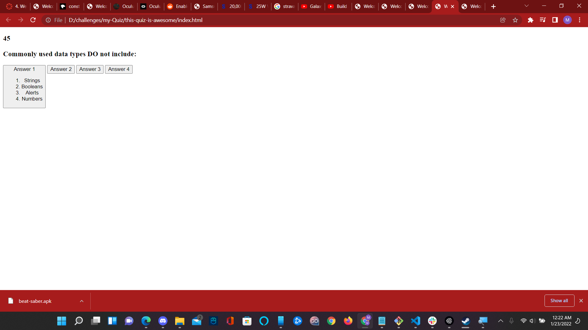

# this-quiz-is-awesome
Welcome to my quiz. This is the latest of a series of challenges that I have been working on for the coding bootcamp. Here you will be taking a quiz to see how much knowledge you have in this subject.

The object of the game is to advance as far as you can get, with as many correct answers as you can. It is timed, so you better think quickly!

However, if you answer incorrectly, while the question will advance nonetheless, you will lose 10 seconds...

Each question is worth 10 points. I wish you luck!

If you wish to contact me for any future program or game if you happen upon this source code, or if you have any issues, please don't hesitate to report in the "issues" section. Enjoy!!!

## Caution, this quiz is very nonfunctional as of this commit!! More details below!

Okay, so the original intent was above, however...that's not the case. I managed to get some functionality, but in all reality, it was very poorly done compared to my previous projects. I will improve on this. For now it is almost entirely NOT functional.

The CSS is nonexistent because I was working on the javascript and the HTML first then I was going to work on the CSS, but due to time constraints, style was not implemented. It has the link and the asset is there, but the file is almost entirely blank.

The high score function does not work at all, the timer disappears when you click on the start button. This is a very buggy mess.

The timer does work when it is there, but it changes to numbers instead of showing "Time remaining."

Here is a screenshot of the current build, I am so sorry.

